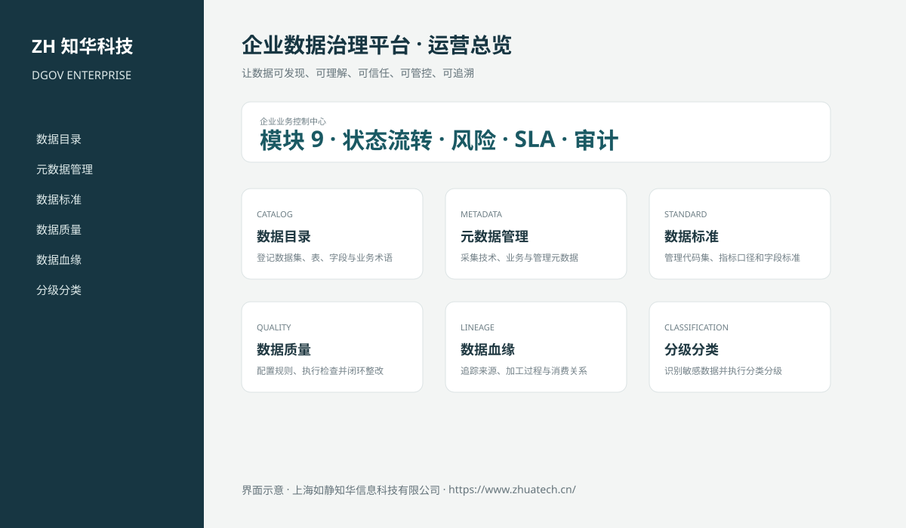
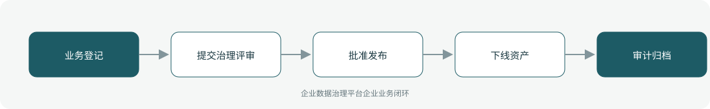

# ZhuaTech DGOV｜企业数据治理平台

> 让数据可发现、可理解、可信任、可管控、可追溯

ZhuaTech DGOV 是知华科技（上海如静知华信息科技有限公司）发布的企业级源码项目，面向“数据目录、元数据、标准、质量、血缘、分级分类、资产运营与安全审计”提供管理端与响应式业务端。工程采用前后端分离架构，所有示例数据均为虚构数据。

[知华科技官网](https://www.zhuatech.cn/) · [架构说明](docs/ARCHITECTURE.md) · [API 文档](docs/API.md) · [企业能力](docs/ENTERPRISE.md) · [测试说明](docs/TESTING.md)



## 业务模块

| 模块 | 核心能力 |
| --- | --- |
| 数据目录 | 登记数据集、表、字段与业务术语 |
| 元数据管理 | 采集技术、业务与管理元数据 |
| 数据标准 | 管理代码集、指标口径和字段标准 |
| 数据质量 | 配置规则、执行检查并闭环整改 |
| 数据血缘 | 追踪来源、加工过程与消费关系 |
| 分级分类 | 识别敏感数据并执行分类分级 |
| 数据资产 | 盘点、确权、评价与运营数据资产 |
| 问题整改 | 分派数据问题、复核与关闭 |
| 访问审计 | 记录授权、查询、导出和异常访问 |



## 企业级控制

- ADMIN / OPERATOR 角色边界和管理员接口隔离；
- 服务端字段、模块、唯一编号和状态迁移校验；
- 组织、期间、责任人、风险等级、到期日和 SLA 统计；
- 幂等创建、JPA 乐观锁、重复提交保护和职责分离；
- 附件 SHA-256 元数据、业务凭证完整性与全流程审计；
- 组合检索、分页、逾期筛选、UTF-8 CSV 导出和协作时间线；
- 外部系统仅预留适配器，使用方自行配置地址与凭据；
- prod profile 拒绝默认密码、弱数据库口令和本地跨域来源。

## 技术架构

- 后端：Java 21、Spring Boot、Spring Security、JPA、Bean Validation、Actuator
- 前端：Vue 3、Vite、Axios，支持桌面端与移动端响应式布局
- 数据库：MySQL 8；自动化测试使用 H2
- 交付：Docker Compose、Nginx、环境变量、GitHub Actions
- Java 包名：`cn.zhuatech.datagovernance`

## 启动与测试

```bash
cd backend && mvn test
cd ../frontend && npm install && npm run build
cd .. && cp .env.example .env && docker compose up --build
```

开发演示账号：`admin / admin123`、`operator / operator123`。生产环境必须通过环境变量替换全部默认凭据。

## 许可与商业授权

Copyright © 2026 上海如静知华信息科技有限公司。

本工程仅允许个人学习、研究和非商业技术交流，**不得用于商业用途**。企业内部使用、生产部署、SaaS运营、项目交付、品牌替换、收费培训、咨询实施或再分发，均须事先获得上海如静知华信息科技有限公司书面授权，详见 [LICENSE](LICENSE)。

深度开发、私有化部署、系统集成与企业数字化咨询，请访问[知华科技官网](https://www.zhuatech.cn/)或扫码联系：

| 微信咨询一 | 微信咨询二 |
| --- | --- |
|  |  |

SEO：企业数据治理平台、DGOV系统源码、企业数字化、Java企业系统、Vue管理系统、知华科技、上海如静知华信息科技有限公司。

## V2.0 专业领域能力

新增独立的数据资产、质量规则、质量执行、治理问题和血缘关系模型。数据资产必须先配置质量规则并通过管理员发布门禁；质量任务按实际总行数和失败行数计算得分，低于阈值自动生成问题单，支持分派、解决、复核关闭。专业工作台入口为“专业业务中心”，API 根路径为 `/api/governance`。
